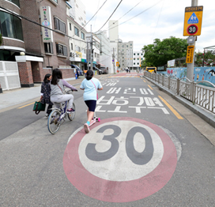

# 알파카 (Alpha car)

## 개발환경

- Python (2.7.17)
- Oracle VM VirtualBox
- Ubuntu (18.04.6 LTS)
- ROS (melodic)
- Morai Simulation
- Android Studio

## 팀원

강동관, 김기한, 박한훈, 이동민, 임영선, 임진현

## 프로젝트 기간

2022.08.22 ~ 2022.10.07

## 개요

  
   
  

- 이용자에게 운전에 대한 부담을 없애고 자동차 소유자에게는 자동차를 사용하지 않는 시간에도 자신의 자동차를 택시로서 활용할 수 있도록 보장해주는 "자율주행 무인 택시 서비스"
  
## 서비스 기획 배경
  
  

    
    
  

- 편리한 이동수단 중 하나일 자동차는 신호를 지켜야하고, 차선을 유지해야하며, 갑작스레 튀어나오는 사람 등을 조심해야하기때문에 운전을 잘 하기란 어려움.

- 센서에 의한 자율주행 시스템을 도입하여 대처하기 어려운 상황을 피하고, 나아가 운전자 없는 운전이 가능하도록 하는 것이 목표

## 주요 기능

### 자율주행

- 다양한 센서를 통한 주변 환경 인식
- 장애물 회피
- 속도 자동 조절
- 전방 자동차 거리 조절

### 모바일

- 회원 관리 (회원가입, 로그인, 마이페이지, 회원정보 수정 등) 
- 즐겨찾기 (주소, 위/경도)
- 유저 / 제공자 화면
- 무인 택시 이용
- 결제 및 후기 등록/관리
- 1:1 채팅 / 챗봇

## 기술별 자료 정리

- [ROS](./study/ROS/README.md)
- [모바일](./aos/README.md)
- [인지(Cognition)](./study/cognition/README.md)
- [판단(Judgment)](./study/judgment/README.md)
- [제어(Control)](./study/control/README.md)

## 외부 링크

- 정보 공유를 위한 [노션](https://www.notion.so/5a5568486fbd4730ab43569cce17472c)
- [MORAI SIM Standard User Manual](https://help-morai-sim-en.scrollhelp.site/morai-sim-standard-en/)